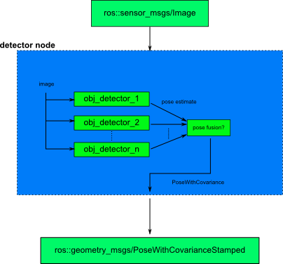
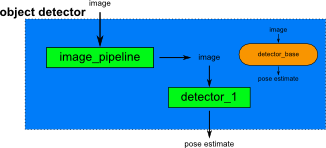
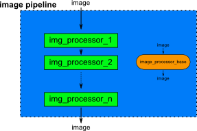

## General flow of things within the detection package
### The Node

 

First we have a look at the overall node structure. As input serves a ros message of type ```sensor_msgs/Image```,
other inputs like depth images or clouds might be considered in the future. The image is fed into one or multiple [object
detectors](#the-object-detector). Each object detector calculates an estimation of the objects position. In case there are multiple object detectors
at work the different pose estimations would have to be merged somehow. 
The whole node produces a ros message (```geometry_msgs/PoseWithCovarianceStamped```) which represents the pose estimation
of the found object. 

### The Object Detector 
Each object detector consists of its own or shared [image processor pipeline](#the-image-processor-pipeline). The prepocesesd image is the input to the detector.
The detector itself provides an estimate of the objects pose. 

- Each object detector is derived from one base class (```ObjectDetecorBase```).



### The Image Processor Pipeline
The image porcessor pipeline consists of one or multiple image processors. The image processors, which are derived from 
one base class (```ImgProcessorBase```), take in an image and provide a processed image in return.


